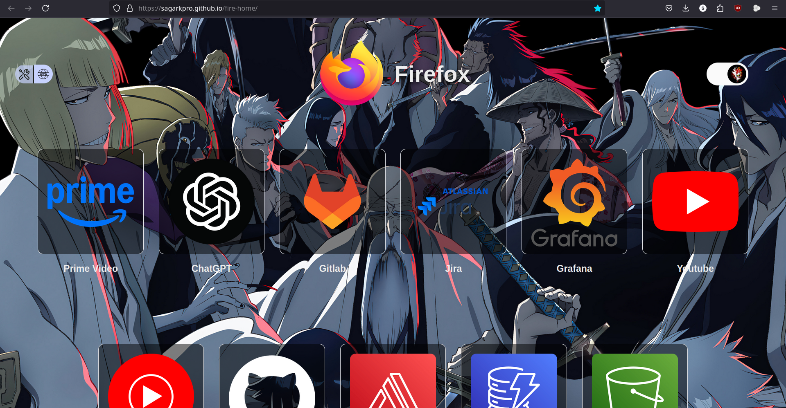
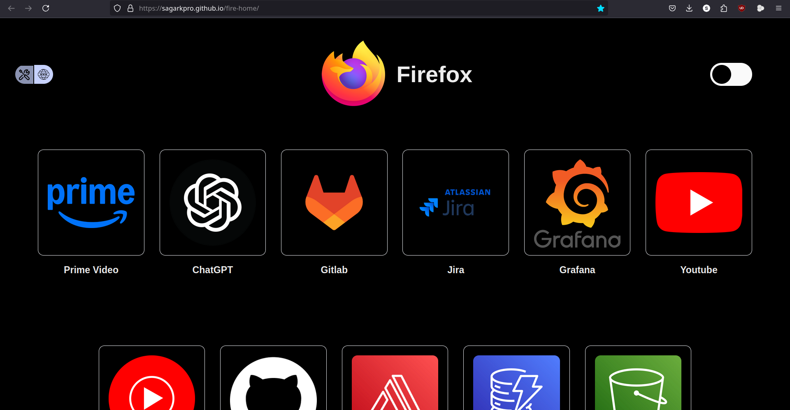
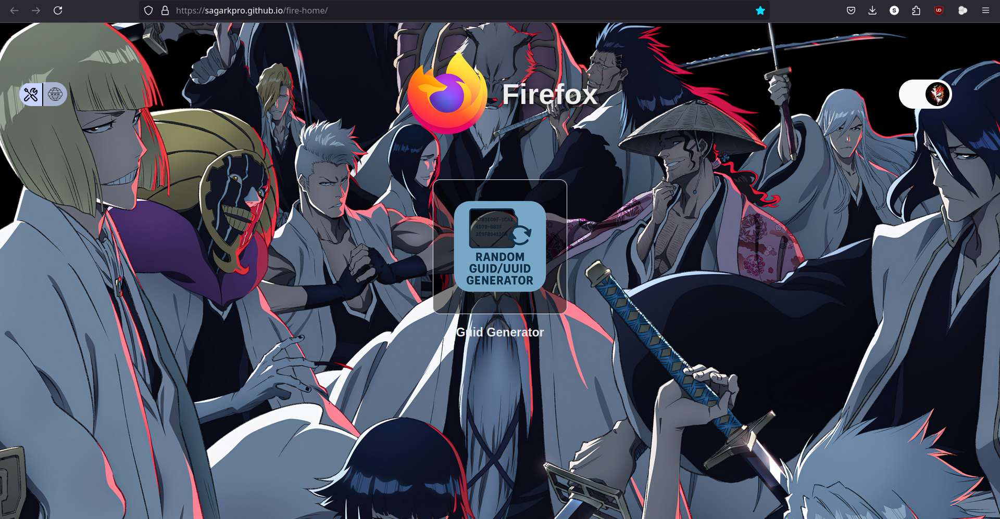
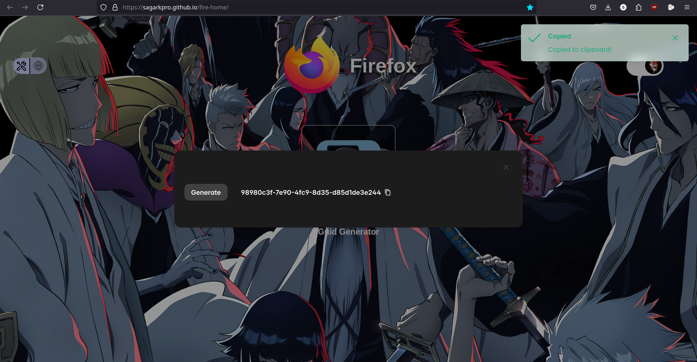

# 🏠 Personalised Browser Home Page

Visit now at: https://sagarkpro.github.io/fire-home/

A custom-built browser home page made with **Next.js 14** and **Tailwind CSS** for quick, distraction-free access to your favorite sites and tools.

✨ **Features:**

- **Quick Access Links** – Direct links to your top websites for faster browsing.
- **Tools Section** – Currently includes a **GUID Generator** (more tools planned).
- **Background Image Toggle** – Switch between a minimal layout and a background image.
- **Clean & Responsive UI** – Optimized for different screen sizes.

## 📸 Screenshots

**Dashboard w/ BG**


**Dashboard w/o BG**


**Tools Screen**


**GUID Generator**


---

## 🚀 Getting Started

First, install dependencies:

```bash
npm install
# or
yarn install
# or
pnpm install
# or
bun install
```

Run the development server:

```bash
npm run dev
# or
yarn dev
# or
pnpm dev
# or
bun dev
```

Open [http://localhost:3000](http://localhost:3000) in your browser to see it live.

---

## 📂 Project Structure

- `app/page.tsx` – Main home page layout & logic.
- `components/` – UI components for quick links, tools, and toggles.
- `styles/` – Tailwind styling.

---

## 📚 Learn More

- [Next.js Documentation](https://nextjs.org/docs) – Learn about Next.js features and API.
- [Tailwind CSS Docs](https://tailwindcss.com/docs) – Explore styling utilities.

---

## ☁ Deployment

The easiest way to deploy is on [Vercel](https://vercel.com/new?utm_medium=default-template&filter=next.js&utm_source=create-next-app).

For more deployment options, see the [Next.js deployment docs](https://nextjs.org/docs/app/building-your-application/deploying).